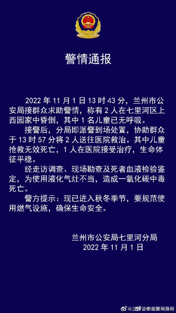

# 七里河事件

## 2022 年 11 月 1 日

@兰州公安七里河分局 发布通报：11 月 1 日 13 时 43 分，兰州市公安局接群众求助警情，称有 2 人在七里河区上西园家中昏倒，其中 1 名儿童已无呼吸。接警后，分局即派警到场处置，协助群众于 13 时 57 分将 2 人送往医院救治。其中儿童抢救无效死亡，1 人在医院接受治疗，生命体征平稳。经走访调查、现场勘查及死者血液检验鉴定，为使用液化气灶不当，造成一氧化碳中毒死亡。

高赞回复：

1 号下午，兰州七里河三岁小孩因母亲摔倒吓到休克，因社区 10 天不做核酸，没有 24 小时核酸不让出去抢救，错过最佳抢救时间，母子死亡。街道通知，所有卡口工作人员不得接受任何电话视频采访。群众激愤，特警镇压，请将这条评论顶上去。
