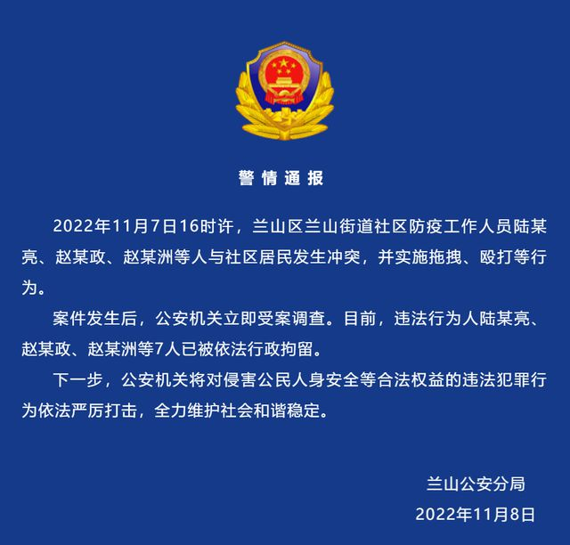

# 有多名身穿防护服的人员对多位居民进行殴打、拖拽等行为

11 月 7 日，网上流传的一段视频引发热议，视频中显示，有多名身穿防护服的人员对多位居民进行殴打、拖拽等行为。

山东临沂兰山公安分局 11 月 8 日发布通报，11 月 7 日 16 时许，兰山区兰山街道社区防疫工作人员陆某亮、赵某政、赵某洲等人与社区居民发生冲突，并实施拖拽、殴打等行为。

案件发生后，公安机关立即受案调查。目前，违法行为人陆某亮、赵某政、赵某洲等 7 人已被依法行政拘留。

## 来源

- https://www.163.com/dy/article/HLOHMLHT0534AAR4.html
- https://www.sohu.com/a/603977403_120541367
